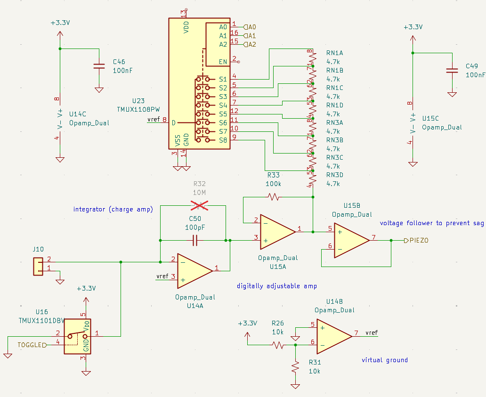
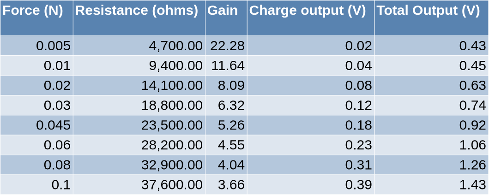

# Piezo Circuit
This board integrates a simple charge amplifier followed by a discrete two-stage PGA followed by a comparator to achieve a fairly sensitive high-temperature piezo trigger circuit. We are aiming to measure down to 0.005N with a standard PZT-5A piezo as a stretch goal.

The circuit itself consists of a charge amplifier feeding into a noninverting discrete programmable gain amplifier followed by a voltage follower to prevent output loading. In addition, the last available opamp channel is used to generate a virtual ground.

## Charge Amplifier
Here we needed the signal to be significant enough to not be consumed by noise. As a PZT-5A piezo has a $d_{33} = 390\cdot 10^{-12} \mathrm{\frac{C}{N}}$, we went with a capacitor value of ${100\mathrm{pF}}$ such that:
$$ V_{charge} = \frac{390\cdot10^{-12} \mathrm{\frac{C}{N}} \cdot 0.005\mathrm{N}}{100\cdot 10^{-12}} = 19.5\mathrm{mV}$$

At the top our range, this comes out to:
$$ V_{charge} = \frac{390\cdot10^{-12} \mathrm{\frac{C}{N}} \cdot 0.1\mathrm{N}}{100\cdot 10^{-12}} = 390\mathrm{mV}$$

Both of these values are very usable for our purposes.

## Non-Inverting Amplifier
The gain of a non-inverting amplifier is: $$G = 1+\frac{R_F}{R_2}$$
From this, we just plug in our values to achieve:
$$G = 1+\frac{100,000\Omega}{n\cdot4,700\Omega}$$
Where $n$ is the active amount of resistors in our resistor ladder as seen on the mux.
From this, we get the folowing table:

